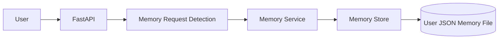

# Orbit Agent V2

> **An autonomous conversational AI agent powered by local Ollama Gemma 3, with persistent user memory, web search, calculator tools, and real-time streaming responses.**

Orbit Agent V2 is a full-stack AI assistant designed around a lightweight **agentic architecture**. Instead of sending every request directly to an LLM, Orbit first determines what type of task the user is asking for and then routes the request to the appropriate capability.

It supports:

* 🤖 Local LLM inference with **Ollama + Gemma 3**
* 🧠 Persistent user memory
* 🔎 Memory retrieval for personalized responses
* 🌐 Live web search using **Tavily**
* 🧮 Safe calculator execution
* ⚡ Real-time token streaming using **Server-Sent Events (SSE)**
* 🧭 Agent planning and execution events
* 💬 Conversation history
* ⚛️ React + TypeScript frontend
* 🐍 FastAPI backend
* 🔐 Environment-based API key configuration

---

## ✨ Features

### 🤖 Local AI

Orbit uses a locally running Ollama model rather than requiring every conversation to be sent to a hosted LLM provider.

```text
User
  ↓
Orbit
  ↓
Ollama
  ↓
Gemma 3
  ↓
Streaming response
```

This allows the core conversational experience to run locally.

---

### 🧭 Intelligent Task Routing

Orbit determines which capability should handle a request.

Supported actions:

```text
calculator
web_search
direct_answer
```

For example:

| User request                    | Orbit action  |
| ------------------------------- | ------------- |
| `25 * 16`                       | Calculator    |
| `What's the latest AI news?`    | Web Search    |
| `Explain encapsulation in Java` | Direct Answer |
| `What is polymorphism?`         | Direct Answer |
| `Bitcoin price today`           | Web Search    |

Orbit also uses a planner prompt when explicit deterministic detection is insufficient.

---

## 🏗️ System Architecture
flowchart TD

    U[👤 User]

    UI[⚛️ React + TypeScript Frontend]

    API[🐍 FastAPI Backend]

    CHAT[/api/chat]

    ROUTER[🧭 Orbit Task Router]

    MEMORY[🧠 Memory Service]

    STORE[(Local JSON Memory Store)]

    CALC[🧮 Calculator Tool]

    WEB[🌐 Tavily Web Search]

    LLM[🤖 Ollama]

    MODEL[Gemma 3]

    SSE[⚡ SSE Streaming Response]

    U --> UI
    UI --> CHAT
    CHAT --> API
    API --> ROUTER

    ROUTER --> MEMORY
    MEMORY --> STORE

    ROUTER --> CALC
    ROUTER --> WEB
    ROUTER --> LLM

    LLM --> MODEL
    MODEL --> LLM

    CALC --> SSE
    WEB --> LLM
    LLM --> SSE

    SSE --> UI
    UI --> U
```

---

# 🧠 Agent Architecture

Orbit follows a simple agent loop:

```text
                ┌─────────────────┐
                │      User       │
                └────────┬────────┘
                         │
                         ▼
                ┌─────────────────┐
                │ Request Received │
                └────────┬────────┘
                         │
                         ▼
                ┌─────────────────┐
                │ Memory Retrieval │
                └────────┬────────┘
                         │
                         ▼
                ┌─────────────────┐
                │   Task Planner   │
                └────────┬────────┘
                         │
             ┌───────────┼───────────┐
             ▼           ▼           ▼
       ┌──────────┐ ┌──────────┐ ┌──────────────┐
       │Calculator│ │Web Search│ │Direct Answer │
       └────┬─────┘ └────┬─────┘ └──────┬───────┘
            │            │              │
            │            ▼              │
            │      ┌────────────┐       │
            │      │    LLM     │       │
            │      │Gemma 3     │       │
            │      └─────┬──────┘       │
            │            │              │
            └────────────┼──────────────┘
                         ▼
                ┌─────────────────┐
                │ Streaming SSE   │
                └────────┬────────┘
                         ▼
                ┌─────────────────┐
                │ React Interface │
                └─────────────────┘
```

---

# 🧭 Request Routing

Orbit uses multiple layers of routing.

### 1. Deterministic Calculator Detection

Simple mathematical expressions are detected directly.

Example:

```text
25 * 16
```

is routed to:

```text
Calculator
```

instead of using an LLM.

This avoids unnecessary model inference.

---

### 2. Web Search Detection

Requests involving dynamic information are routed to web search.

Examples include:

```text
latest
current
today
recent
news
live
real-time
stock price
weather
exchange rate
flight status
sports score
```

Orbit can also recognize explicit requests such as:

```text
search the web
look it up
browse the web
find online
```

---

### 3. LLM Planner

If deterministic rules do not identify the task, Orbit asks the local LLM to classify the request.

The planner returns:

```json
{
  "action": "direct_answer",
  "reason": "The request is a normal programming question.",
  "expression": ""
}
```

The supported actions are:

```text
calculator
web_search
direct_answer
```

---

# 🧠 Persistent Memory

Orbit includes a persistent user-memory system.

When a user explicitly asks Orbit to remember something:

```text
Remember that I prefer Java for DSA.
```

Orbit detects the memory request and stores the information.

The memory is associated with:

```text
user_id
```

rather than only the conversation.

This allows memories to remain available across different conversations for the same user.

---

## Memory Flow



---

## Memory Storage

Memories are stored locally under:

```text
backend/data/memories/
```

Each user receives a separate JSON file.

Conceptually:

```text
backend/
└── data/
    └── memories/
        └── <user_id>.json
```

A memory record contains fields such as:

```json
{
  "id": "...",
  "type": "general",
  "content": "I prefer Java for DSA.",
  "importance": 0.8,
  "embedding": null,
  "created_at": "...",
  "updated_at": "..."
}
```

### Important

Memory files contain user-specific information and should **never be committed to GitHub**.

The repository ignores:

```text
backend/data/memories/
```

---

# 🔎 Memory Retrieval

When a normal request arrives, Orbit searches the user's stored memories.

The current lightweight retrieval implementation:

1. Loads the user's memories.
2. Tokenizes the query.
3. Removes common stop words.
4. Calculates word overlap.
5. Combines similarity with memory importance.
6. Sorts the results.
7. Selects the most relevant memories.

The resulting memory context is supplied to the assistant.

Example:

```text
RELEVANT USER MEMORY:

- I prefer Java for DSA.
- I am building an AI project called Orbit.
```

Orbit can then use this context when generating the answer.

---

# 🌐 Web Search

Orbit supports live web search through **Tavily**.

The flow is:

```text
User Request
     ↓
Task Detection
     ↓
Web Search
     ↓
Tavily Results
     ↓
Source Collection
     ↓
Gemma 3 Analysis
     ↓
Streaming Answer
```

Each source contains:

```text
title
url
snippet
```

The frontend can display these sources alongside the generated response.

---

# 🧮 Calculator Tool

Mathematical expressions are handled by a dedicated calculator instead of asking the LLM to perform the calculation.

Example:

```text
125 * 48
```

Orbit can directly produce:

```text
125 × 48 = 6000
```

Expressions containing:

```text
+
-
*
/
()
%
^
```

can be routed through the calculator detection layer.

---

# ⚡ Real-Time Streaming

Orbit uses **Server-Sent Events (SSE)** to stream responses from the FastAPI backend to the React frontend.

Instead of waiting for the entire response:

```text
Backend
   ↓
Complete response
   ↓
Frontend
```

Orbit streams tokens progressively:

```text
Backend
   ↓
Token → Token → Token → Token
   ↓
Frontend
   ↓
Live response
```

The frontend consumes:

```text
text/event-stream
```

from:

```text
POST /api/chat
```

---

# 📡 SSE Event Types

Orbit communicates different events to the frontend.

### Content

```json
{
  "type": "content",
  "content": "Hello"
}
```

### Agent Event

```json
{
  "type": "agent",
  "step": "web_search",
  "label": "Searching the web",
  "status": "started"
}
```

### Source

```json
{
  "type": "source",
  "title": "Example",
  "url": "https://example.com",
  "snippet": "..."
}
```

### Status

```json
{
  "type": "status",
  "status": "searching"
}
```

### Error

```json
{
  "type": "error",
  "message": "..."
}
```

### Done

```json
{
  "type": "done"
}
```

---

# 🖥️ Frontend

The frontend is built using:

* React
* TypeScript
* Vite

The frontend communicates with FastAPI through:

```text
VITE_API_URL
```

If no value is provided, it defaults to:

```text
http://localhost:8000
```

---

# 🐍 Backend

The backend is built using:

* Python
* FastAPI
* Pydantic
* Ollama
* Tavily

Main API:

```text
POST /api/chat
```

Health endpoint:

```text
GET /api/health
```

---

# 📁 Project Structure

```text
orbit-ai/
│
├── backend/
│   │
│   ├── app/
│   │   ├── agents/
│   │   │   ├── __init__.py
│   │   │   ├── executor.py
│   │   │   ├── orchestrator.py
│   │   │   ├── planner.py
│   │   │   └── state.py
│   │   │
│   │   ├── api/
│   │   │   ├── __init__.py
│   │   │   └── chat.py
│   │   │
│   │   ├── llm/
│   │   │   ├── __init__.py
│   │   │   └── ollama.py
│   │   │
│   │   ├── rag/
│   │   │   ├── __init__.py
│   │   │   ├── chunking.py
│   │   │   ├── memory_service.py
│   │   │   ├── memory_store.py
│   │   │   ├── ollama_embeddings.py
│   │   │   └── retriever.py
│   │   │
│   │   ├── tools/
│   │   │   ├── __init__.py
│   │   │   ├── calculator.py
│   │   │   └── web_search.py
│   │   │
│   │   ├── config.py
│   │   └── main.py
│   │
│   ├── data/
│   │   └── memories/
│   │
│   ├── .env.example
│   └── requirements.txt
│
├── frontend/
│   │
│   ├── src/
│   │   ├── lib/
│   │   │   └── supabase.ts
│   │   │
│   │   ├── App.tsx
│   │   ├── api.ts
│   │   ├── index.css
│   │   ├── main.tsx
│   │   └── vite-env.d.ts
│   │
│   ├── .env.example
│   ├── index.html
│   ├── package.json
│   ├── package-lock.json
│   ├── tsconfig.json
│   └── vite.config.ts
│
├── .gitignore
└── README.md
```

---

# ⚙️ Requirements

### Software

* Python 3.11+
* Node.js 18+
* Ollama
* Git

### Ollama Model

Orbit currently expects:

```text
gemma3:latest
```

Check installed models:

```powershell
ollama list
```

If Ollama is not running:

```powershell
ollama serve
```

Pull the model if required:

```powershell
ollama pull gemma3:latest
```

---

# 🚀 Installation

## 1. Clone the repository

```powershell
git clone https://github.com/YOUR_USERNAME/orbit-ai.git
cd orbit-ai
```

---

# 🐍 Backend Setup

Enter the backend:

```powershell
cd backend
```

Create a virtual environment:

```powershell
python -m venv .venv
```

Activate it:

```powershell
.\.venv\Scripts\Activate.ps1
```

Install dependencies:

```powershell
pip install -r requirements.txt
```

Create the environment file:

```powershell
Copy-Item .env.example .env
```

Configure the required values in:

```text
backend/.env
```

Example:

```env
OLLAMA_MODEL=gemma3:latest
TAVILY_API_KEY=your_tavily_api_key
```

Never commit `.env`.

---

# ▶️ Start Backend

From the `backend` directory:

```powershell
uvicorn app.main:app --reload --port 8000
```

Backend:

```text
http://localhost:8000
```

Health check:

```text
http://localhost:8000/api/health
```

Expected response:

```json
{
  "backend": "running",
  "ollama": "reachable",
  "model": "gemma3:latest"
}
```

---

# ⚛️ Frontend Setup

Open another terminal.

From the project root:

```powershell
cd frontend
```

Install dependencies:

```powershell
npm install
```

Start Vite:

```powershell
npm run dev
```

The frontend normally runs at:

```text
http://localhost:5173
```

---

# 🔐 Environment Variables

## Backend

Create:

```text
backend/.env
```

from:

```text
backend/.env.example
```

Potential configuration includes:

```env
OLLAMA_MODEL=gemma3:latest
TAVILY_API_KEY=your_tavily_api_key
```

## Frontend

Create:

```text
frontend/.env
```

if you need to override the backend URL:

```env
VITE_API_URL=http://localhost:8000
```

---

# 🔒 Security

Orbit intentionally keeps secrets outside the repository.

The following should never be committed:

```text
.env
API keys
local memory files
node_modules
Python virtual environments
generated build files
```

The repository's `.gitignore` excludes these files.

---

# 🔄 Complete Request Lifecycle

For a normal question:

```text
User
 ↓
React UI
 ↓
POST /api/chat
 ↓
FastAPI
 ↓
Memory Retrieval
 ↓
Task Router
 ↓
Direct Answer
 ↓
Ollama
 ↓
Gemma 3
 ↓
SSE Token Stream
 ↓
React UI
```

For a web-search request:

```text
User
 ↓
React UI
 ↓
FastAPI
 ↓
Task Router
 ↓
Web Search
 ↓
Tavily
 ↓
Sources
 ↓
Gemma 3
 ↓
SSE Stream
 ↓
React UI
```

For a calculation:

```text
User
 ↓
FastAPI
 ↓
Calculator Detection
 ↓
Calculator Tool
 ↓
Result
 ↓
SSE
 ↓
React UI
```

For a memory request:

```text
User
 ↓
Memory Detection
 ↓
Memory Service
 ↓
Memory Store
 ↓
User Memory File
 ↓
Confirmation
```

---

# 🩺 Health Check

Orbit exposes:

```http
GET /api/health
```

The endpoint reports:

* Backend status
* Ollama availability
* Configured Ollama model

Example:

```json
{
  "backend": "running",
  "ollama": "reachable",
  "model": "gemma3:latest"
}
```

---

# 🧪 Example Requests

### Direct answer

```text
Explain Java encapsulation with an example.
```

### Calculator

```text
125 * 48
```

### Web search

```text
What are the latest developments in AI?
```

### Memory

```text
Remember that I prefer Java for DSA.
```

Later:

```text
What programming language do I prefer for DSA?
```

Orbit can retrieve the stored memory and use it when answering.

---

# 🛠️ Technology Stack

| Layer            | Technology                                  |
| ---------------- | ------------------------------------------- |
| Frontend         | React                                       |
| Language         | TypeScript                                  |
| Frontend tooling | Vite                                        |
| Backend          | FastAPI                                     |
| Backend language | Python                                      |
| LLM runtime      | Ollama                                      |
| LLM              | Gemma 3                                     |
| Web search       | Tavily                                      |
| Memory           | Local JSON storage                          |
| Retrieval        | Lightweight similarity + importance ranking |
| Communication    | HTTP + SSE                                  |
| Configuration    | Environment variables                       |

---

# 🎯 Design Goals

Orbit Agent V2 is designed around several principles:

### Local-first AI

Use Ollama for local model inference wherever possible.

### Tool-aware execution

Use specialized tools instead of forcing the LLM to perform every operation.

### Persistent personalization

Store explicit user memories independently from individual conversations.

### Streaming UX

Return generated content progressively instead of waiting for the complete response.

### Clear agent visibility

Expose planning, search, analysis, writing, success, and failure events to the frontend.

### Modular architecture

Keep:

```text
agents
llm
rag
tools
api
frontend
```

separated so that individual components can evolve independently.

---

# 🚧 Current Limitations

Orbit Agent V2 is intentionally lightweight.

Current limitations include:

* Local JSON storage is suitable for development/prototyping but not large-scale production.
* Memory retrieval currently uses lightweight lexical similarity rather than a full vector database pipeline.
* Ollama must be running locally.
* Web search requires a valid Tavily API key.
* Authentication and multi-user production infrastructure are not the primary focus of this version.
* The agent action space is currently limited to calculator, web search, and direct answers.

---

# 🔮 Future Improvements

Potential future versions can introduce:

* Vector database-backed memory
* Semantic embeddings for improved memory retrieval
* Conversation persistence
* Authentication
* User profiles
* More autonomous tools
* Multi-step task execution
* Tool calling
* Long-term memory management UI
* Memory editing and deletion UI
* Background task execution
* Agent planning graphs
* Docker deployment
* Production database
* Cloud deployment
* Observability and tracing

---

# 📌 Project Status

**Orbit Agent V2 — Active Development**

The current version demonstrates the core architecture of a local autonomous conversational agent with:

```text
LLM
+
Agent Routing
+
Memory
+
Web Search
+
Calculator
+
Streaming
+
React UI
```

---

# 👨‍💻 Author

**Krishna Bajaj**

Built as an AI/agent engineering project exploring:

* Artificial Intelligence
* Large Language Models
* Agentic Systems
* Retrieval-Augmented Generation
* Local LLMs
* Full-Stack Development
* AI Tool Integration

---

## ⭐ If you find the project useful

Consider starring the repository and following the project as it evolves.
